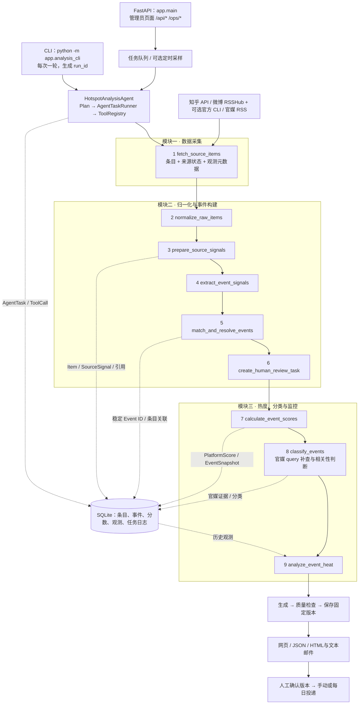

# 舆情热点分析系统

当前系统复用**固定九步 Agent 编排**完成采集、事件构建和分平台分析，再生成固定版本的每日简报。第八周 MVP 已接通过去 24 小时的知乎／微博／官媒栏目、A–F 分类、平台内趋势、管理后台和 HTML 邮件流程。入口是 `backend/app/briefing_cli.py` 与 `backend/app/main.py`；原 `analysis_cli.py` 仍可单独运行一轮九步分析。第九周已补齐 Docker、按天日志和每日自动投递，本地配置默认关闭自动任务，部署模板可开启。阿里云实践与长图导出仍待完成。

先看 [MVP 运行说明](docs/briefing-mvp.md)；本机启动后访问 <http://127.0.0.1:8000>。实际完成范围和仍待完成的 24 小时／真实邮箱验收见 [briefing-v0.1](reports/briefing-v0.1.md)。

## 运行结构



`HotspotAnalysisAgent` 在 [`backend/app/agents/analysis.py`](backend/app/agents/analysis.py) 构造固定 Plan；`AgentTaskRunner` 按依赖执行，`ToolRegistry` 校验输入、调用工具并记录任务与工具日志。这里的 Agent 是**可审计的确定性编排**，不是已接入 LLM 的动态规划器。九步中的业务算法仍由各 Tool 内部的 Collector、Agent 或 service 完成，并非每个算法函数都是单独注册的 Tool。

默认注册表共有 **16 个 Tool**：下表的 9 个属于分析主链路；另外包括独立评估、日报 Guardrails，以及已接通的日报生成、质量检查和保存工具。MVP 在分析之后执行三步日报 Plan；图片渲染和 Mode B 检索仍为占位。

| 顺序 | Tool | 当前职责和主要交接数据 |
|---|---|---|
| 1 | `fetch_source_items` | 调度采集器；各采集器先把不同 API／RSS／CLI 响应映射成项目条目，返回条目、每源状态、榜单完整性及观测元数据。 |
| 2 | `normalize_raw_items` | 对已映射的条目做结构归一化与数据清洗：清理文本、URL、时间，补内容 hash 和质量标记，产出同一 `NormalizedItem` 结构；原始平台指标仍保留原义。 |
| 3 | `prepare_source_signals` | 保存或复用 `Source`／`Item`，把数据库 `Item.id` 写进来源引用，生成带来源、平台、信号角色及父子关系的 `SourceSignal` 和匹配引用。 |
| 4 | `extract_event_signals` | 从来源信号按已接入的规则抽取主题、关键词、实体、动作、类型、时间提示和弱信号标记，产出 `EventSignal`；LLM 增强尚不可用。 |
| 5 | `match_and_resolve_events` | 召回候选、比较并经 Guardrails 决定创建、合并、待复核或拒绝；落库后传出稳定 `event_ids` 与条目 hash→事件 ID 映射。 |
| 6 | `create_human_review_task` | 为 `candidate_review` 建立人工复核任务；没有候选时跳过。 |
| 7 | `calculate_event_scores` | 根据本轮采集观测计算知乎/微博**分平台**热度，保存 `PlatformScore` 与对应观测。 |
| 8 | `classify_events` | 结合社区覆盖和官媒证据分类；必要时对官媒站点发 query，搜索结果仍须经过事件相关性、来源和时间检查。 |
| 9 | `analyze_event_heat` | 从已保存的观测分析近 24 小时持续上榜时间和趋势，不重复制造采集观测。 |

关键接口不是只传一组新闻标题：采集器负责来源字段的初步映射，`normalize_raw_items` 再把条目清洗成统一结构；来源标识在采集结果中已经存在，`prepare_source_signals` 的关键工作是**落库和建立可追溯引用**，并非只给数据贴来源标签。它以 `Item.id`／引用串起 `SourceSignal` 和 `EventSignal`；事件构建以稳定的 `Event.event_id` 及条目 hash 映射把本轮数据交给热度计算。采集结果同时保留来源观测元数据，评分和趋势共用真实 `observation_id`；同一 `run_id` 重跑会复用首次采集响应，要得到新观测必须使用新的轮次。完整字段与失败行为见[三模块数据接口说明](docs/hotspot-analysis-workflow.md)。

## 三个模块的实现程度

**数据采集：已接入，持续使用受外部服务条件约束。** 已注册知乎热榜与搜索、微博 RSSHub 热搜，以及人民网／中新网／新华网 RSS 采集器；项目使用的 `@weibo-ai/weibo-cli` 是[微博开放平台官方 CLI](https://open.weibo.com/cli/quickstart)，在当前链路中只做已知话题的内容增强。CLI 的官方身份不等于项目能够长期免费调用：平台要求开发者认证和服务开通，体验服务有期限与接口次数限制，长期正式使用依赖付费积分及余额；未开通、额度不足或授权失效时只能降级到 RSSHub 话题种子等已有来源。官媒定向搜索位于第 8 步的分类服务内：先用 query 找候选，再判断是否确实报道目标事件，搜索命中本身不算支持，也不计入社区热度。采集结果区分成功、失败、空榜、榜单完整性和质量问题。2026-09-28 的[真实采集验证](reports/live-analysis-validation-2026-09-28.md)完成过一轮五源、24 条数据的九步链路；后续微博 CLI 单独复测成功，但没有据此重新跑完整链路。这些记录不能代表各来源的长期可用率。

**归一化、事件提取与聚合：规则抽取和事件匹配主链路已实现。** `normalize_raw_items` 清洗采集器已映射的条目并校验统一结构；`prepare_source_signals` 保存条目、补齐 `source_citation.item_id`，再组装供抽取和匹配使用的来源信号。两步都不负责把知乎投票数和微博互动数换算成同一种热度。

`extract_event_signals` 的**规则抽取已接入实际九步链路**：从标题、话题及可用的来源字段提取关键词、实体、动作、事件类型、弱信号和匹配文本，并输出有来源引用的 `EventSignal`。它能处理当前规则覆盖的形式，但仍可能漏掉改写后的实体、主体角色或事件进展；`event_time_hint` 多来自发布时间，只是提示，不等同于核实的事发时间。本轮匹配更新修正了部分实体截取错误，例如避免把动作短句截成机构名、把“市场”等误认成地名；这属于规则抽取的小范围修补，不是换成了新的 LLM 抽取方法。

跨条目的**事件合并**发生在下一步 `match_and_resolve_events`：先利用规范身份、URL、知乎父问题身份和 BM25 召回；本地模型可用时，`hybrid` 加入 embedding 与 RRF，`hybrid_rerank` 再加入 cross-encoder。N-gram、实体／动作／时间约束与 Guardrails 参与最后判定，高语义分不能单独触发自动合并。待复核条目不会先关联到候选事件；人工任务可通过 `/ops/human-review/tasks` 查看和处理。具体规则和模型安装见[匹配更新说明](docs/matching-upgrade.md)。

**LLM 抽取增强尚未实现。** 代码已有 `EventExtractionRefinement` 的受限输出结构、逐条选择条件、输入字段组装和“LLM 失败后保留规则结果”的降级逻辑；但默认 `DeepSeekEventExtractionClient.refine()` 直接抛出 `not implemented`，没有完成真实请求、提示词构造与响应解析。全局开关和单轮 `use_llm` 默认都为 `false`，当前 CLI 也没有 `--use-llm` 参数。因而它既不是“事件抽取完全没做”，也不是“只差一个可用 API Key”：可工作的部分是规则抽取，LLM refinement 仍需实现客户端和提示词，再接入与验证。

**热度计算与监控：分平台评分和观测分析已实现。** 知乎评分使用真实榜单名次、重复上榜、排名变化及可用互动指标；搜索结果不伪装成热榜名次。微博以 RSSHub 话题出现作为榜单信号，CLI 的相关内容和互动是可选增强；RSS 顺序不当作微博官方排名。分数按事件和平台汇总，缺少指标时保留 `partial`／`unknown`，**没有把两平台分数相加成统一热度值**。趋势读取多轮、同口径的观测，判断当前上榜、连续上榜时间及 `rising`／`stable`／`cooling`；采集失败、榜单不完整、采样间隔缺失或历史不足时保留未知或受限结果。当前 CLI 只运行一轮，`--interval-minutes` 声明预期采样间隔，并不会启动定时任务。官媒支持和 A–F 优先级分类已接入第 8 步，但分类正确性仍受上游事件匹配及官媒证据质量约束。

## 本地调用

需要 Python 3.11+。下面从项目根目录开始；命令示例为 PowerShell。完整分析使用 SQLite（默认位于 `backend/data/app.db`），首次 CLI 运行会初始化表。

```powershell
py -3.11 -m venv .venv
.\.venv\Scripts\python.exe -m pip install -e "./backend[dev]"
cd backend
$env:ZHIHU_ACCESS_SECRET = "<你的知乎开放平台密钥>"
..\.venv\Scripts\python.exe -m app.analysis_cli --sources zhihu_hot_list --limit 5 --interval-minutes 120 --matching-profile rules
```

这条命令实际调用知乎 API，并依次执行九个 Tool。`--matching-profile rules` 便于在未下载语义模型时先运行规则基线；默认配置为 `hybrid_rerank`，启用本地 embedding/rerank 的安装方法见[匹配更新说明](docs/matching-upgrade.md#模型安装与运行)。真实运行默认允许限额内的官媒定向搜索，可用 `--no-official-search` 关闭。每次调用默认生成新的 `run_id`；显式复用旧 ID 是回放该轮采集，不是重新抓取。回放、隔离数据库与结构化输出见[工作流说明](docs/hotspot-analysis-workflow.md#运行与离线验证)。

微博源需要先启动 RSSHub；官方 CLI 增强还需要安装、登录、开通可用服务并设置 `WEIBO_CLI_ENABLED=true`。运行前可用 `weibo-cli doctor` 检查授权及服务状态，正式使用须考虑积分消耗。下面的独立采集脚本只验证微博采集器，不执行完整九步分析。

```powershell
docker compose -f ..\docker-compose.weibo.yml up -d rsshub
..\.venv\Scripts\python.exe scripts/weibo_heat_minimal.py --base-url http://localhost:1200 --json
npm install -g @weibo-ai/weibo-cli@0.9.1
weibo-cli auth login
weibo-cli doctor
..\.venv\Scripts\python.exe scripts/weibo_heat_minimal.py --base-url http://localhost:1200 --with-cli --cli-topic-limit 3 --json
$env:WEIBO_CLI_ENABLED = "true"  # 此开关用于完整分析链路中的可选 CLI 增强
```

完成外部服务配置后，可用 `--sources zhihu_hot_list weibo_rsshub_hot_search people_politics_rss chinanews_scroll_rss xinhua_politics_rss` 跑多源一轮。`docker-compose.weibo.yml` 与 `backend/Dockerfile.weibo` 只覆盖 RSSHub／微博最小采集，不是整个后端的部署方案。知乎也可单独执行 `python scripts/zhihu_smoke_test.py --limit 10` 验证凭据和热榜接口。

API 需要另开进程。现在提供管理员页面、`POST /api/jobs` 启动采集、日报／用量／投递查询及原有 `/ops/*` 运维接口；管理接口需要管理员令牌。MVP 推荐使用仓库根目录 `.venv`，在 `backend` 目录执行：

```powershell
..\.venv\Scripts\python.exe -m app.briefing_cli init
..\.venv\Scripts\python.exe -m uvicorn app.main:app --host 127.0.0.1 --port 8000
```

## 评估结果与尚未完成的工作

[评估 v0.1](reports/evaluation-v0.1.md) 是改进前基线：134 条用例、118 条通过，暴露了官媒误匹配、未知搜索质量提高置信度及榜单完整性标记丢失等问题。[评估 v0.2](reports/evaluation-v0.2.md) **不只评估官媒 query**：它还测试归一化接口、事件合并、平台热度、趋势与完整九步链路，并对 `rules`／`hybrid`／`hybrid_rerank` 做同集对照。官媒 query 负责找候选，后续相关性与证据规则负责判定；这部分是 v0.2 的重点改进之一。v0.2 对原有 134 条有 132 条通过；扩充到 208 条后为 193 条通过、15 条预期不符、0 条执行错误。未知搜索质量和已知短榜／空榜完整性的问题已修复。官媒扩充集 46 条为 TP=10、FP=0、FN=4、TN=32；官媒误匹配的改善主要来自**事件字段与证据判定规则修复**，不能单独归功于 rerank。事件合并的 81 对用例为 TP=25、FP=0、FN=10、TN=46。规则抽取器的实体截取修补已进入这条链路，但报告没有单独给出“事件特征抽取准确率”，也未测试 LLM refinement。上述数据是离线、混合来源的小样本结果，新增标签待人工复核，不能当成线上总体准确率或长期稳定性指标。

接下来仍需处理：

- **漏合并和漏补证。** 分析 10 对未自动合并的正例与 4 条官媒漏检，区分应当转人工的保守决策和实际漏召回；补充自然跨平台正例及人工复核标签。现有人工队列主要接收事件合并的 `candidate_review`，官媒相关性疑难项尚未自动进入该队列。
- **持续验证时效策略。** 后续已修复旧官媒报道重新抓取后进入当天热点的问题；按滚动 24 小时和可靠发布时间入池，合法短榜／空榜可判断离榜。缺失发布时间导致的漏收、无提示截断和历史回放限制见 [v0.1 修复说明](reports/evaluation-v0.1.md#本轮问题定位)。
- **多轮实采与长期监控。** 现有真实记录只覆盖有限轮次；还需连续采样测源可用率、限流、榜单完整性与趋势质量。微博官方 CLI 的主要持续使用约束是认证、服务开通与付费额度，不能因为单次调用成功就把长期可调用性当成已解决。官媒搜索实测中中新网可用，人民网请求曾返回 HTTP 405；旧 RSS 内容或缺失发布时间也会影响判断。
- **MVP 运行验收与扩展。** 日报生成、质量复核、固定版本保存、页面和邮件流程已经接通；连续 24 小时实采与真实收件邮箱验收仍在进行／待配置。图片渲染、Mode B 检索、LLM 动态规划和压力测试仍未完成。

评估报告使用离线用例：完整链路会运行现有九步 Plan，但替换采集返回值；v0.2 **没有再次调用**知乎 API 或微博 CLI。评估方法、逐例失败和局限以两份报告为准。

## 部署与后续交付

### Docker 部署与一天试运行

使用根目录 `compose.yml` 与 `backend/Dockerfile` 运行完整后端、管理页面及 RSSHub。支持持久化、健康检查、按天日志、每日质量检查后自动发送简报，以及自动任务的试运行截止时间。默认通过 SSH 隧道访问后台。

本地 Linux 容器与 Mailpit 验证已完成，阿里云部署和真实邮箱的 24 小时验收待接入。见 [部署步骤](docs/deployment.md) 与 [本地验收](reports/deployment-local-v0.1.md)。

### 热点图／日报图片生成（待实现）

日报内容、来源引用、网页和 HTML／纯文本邮件已实现。长图是可选导出，`render_briefing_image` Tool 仍返回 `not_implemented`。

### 后端管理页面（MVP 已实现）

提供简报与历史、来源健康／请求用量／采集任务、候选对比与人工复核、邮件投递记录四个栏目。人工决定触发原始时间重算和更正草稿；完整 Agent Ops 扩展沿用第九周计划。
